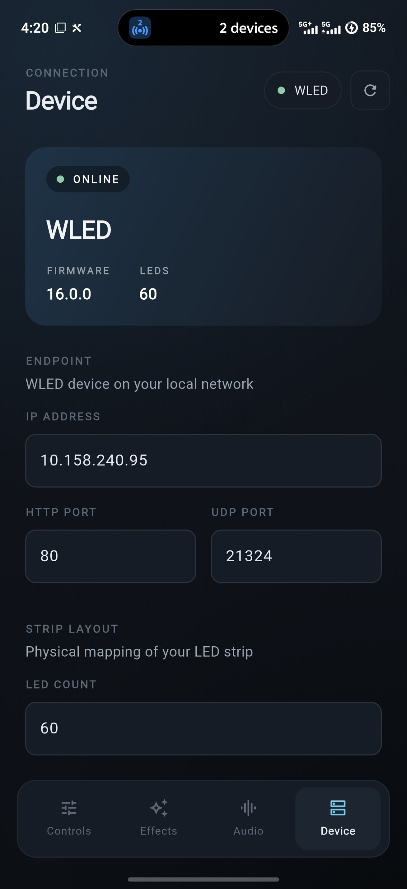
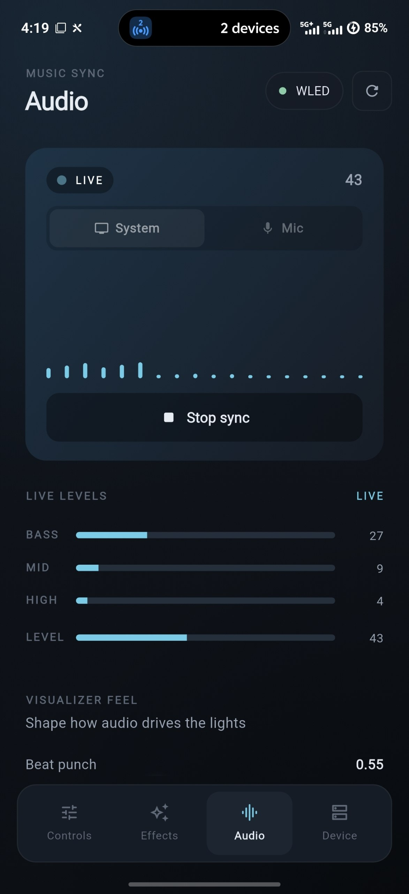
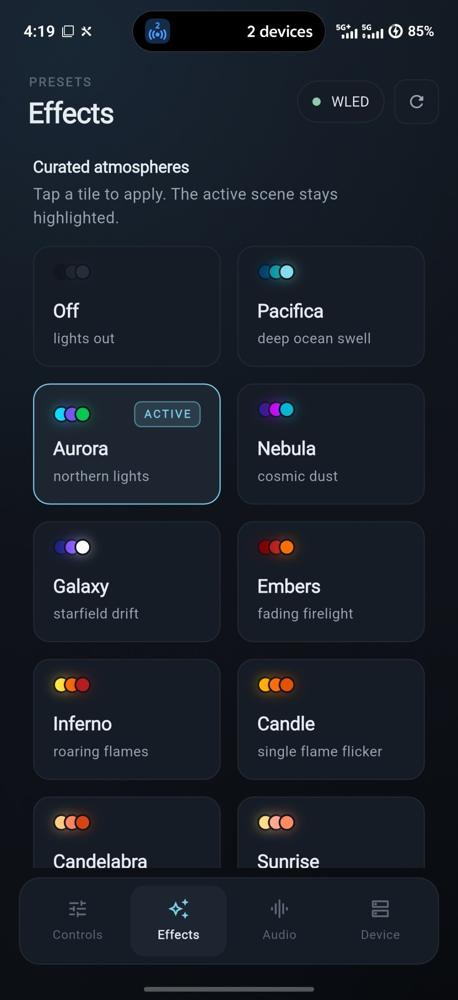
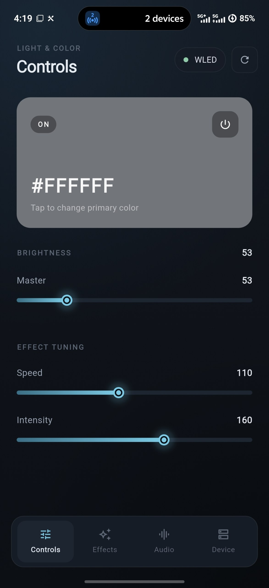
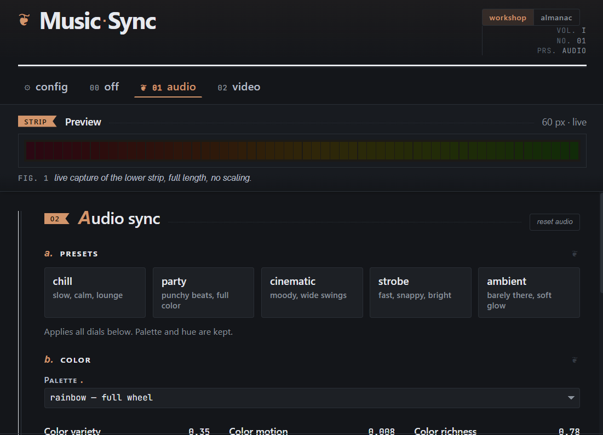
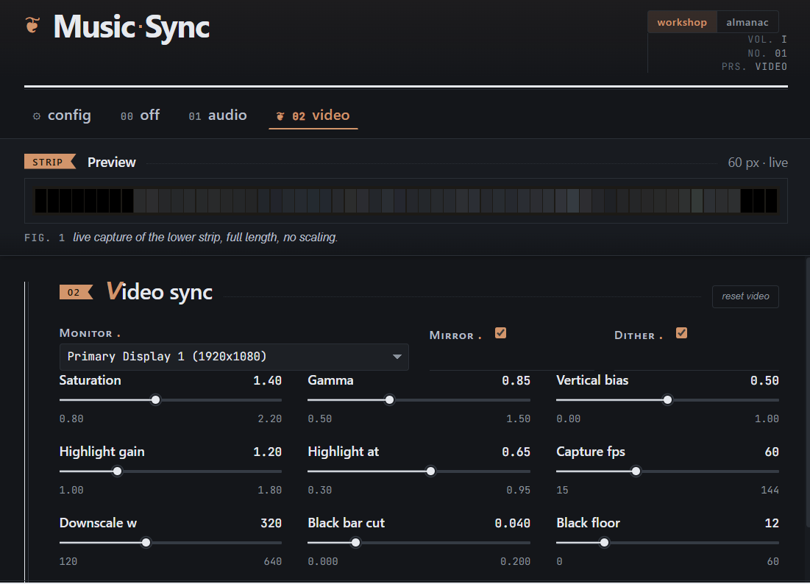

  

<h1 align="center">MusicSync</h1>

  Drive WLED from what you're <b>hearing</b> and what you're <b>seeing</b>. 
  Audio-reactive + display-reactive LED sync, phone and desktop.

---

MusicSync turns your WLED strip into an extension of your speakers or your
screen. Instead of relying on WLED's built-in effects, the phone or PC
draws every frame itself and streams the strip pixel-by-pixel over the
network.

Two apps — one for **Android**, one for **Windows** — talking the same
protocol to the same strip.

## Screenshots

### Android

  
  
  
  

### Desktop (Windows)

  
  

## Features

- **Music sync** — the strip dances to whatever's playing on your phone or
  PC. No external hardware, no aux cable.
- **Mic sync** (Android) — clap, talk, or play live music in front of the
  phone; the strip reacts. Permission is only asked the moment you tap
  *Start mic sync*, never at launch.
- **Screen sync** (Windows) — ambilight mode. The strip mirrors the colors
  on the edge of your monitor in real time.
- **26 custom presets** (Android) — Fire, Heartbeat, Aurora, Lightning,
  Police, Sunrise, and more. Each one is drawn from scratch by the app, so
  the *name* on the tile actually matches what you see on the strip.
- **Color lock** for music sync — pick a hue (red, cyan, violet…) and the
  whole strip stays in that family while still pulsing with the beat.
- **Background-safe** — lock your phone, alt-tab, walk away. The strip
  keeps animating.
- **Direct over Wi-Fi** — no cloud, no account, no MQTT broker. App talks
  straight to the strip on your LAN.

## Setup

### Hardware

- An **ESP32** (or ESP8266) running [WLED](https://kno.wled.ge/).
  ESP32 is recommended for high LED counts and stable UDP throughput.
- An addressable LED strip wired to the ESP. WLED supports a wide list —
  the common ones:
  - **WS2812B** / NeoPixel (5V, 3-wire)
  - **WS2811**, **WS2813**, **WS2815** (12V variants)
  - **SK6812 RGBW**
  - **APA102** / DotStar (4-wire, clocked)
- A 5V (or 12V, depending on strip) power supply rated for your LED count.

### WLED configuration

1. Flash WLED to the ESP, connect it to your home Wi-Fi.
2. Open the WLED web UI → **Config → LED Preferences**. Set the correct
   LED count and chipset.
3. **Config → Sync Interfaces** → enable **Realtime UDP** on port `21324`.
   This is what MusicSync streams to.
4. Note the strip's IP address — you'll paste it into the app once.

### App

- **Android** → [android/README.md](android/README.md) (Flutter, Android 10+).
- **Windows** → [desktop/README.md](desktop/README.md) (Wails, Go + Svelte).

Open the app, paste the WLED IP, set your LED count and you're done.

## Todo

- **Windows app** — close to system tray, auto-start on Windows startup,
  keep running in the background.

## License

[MIT](LICENSE).
